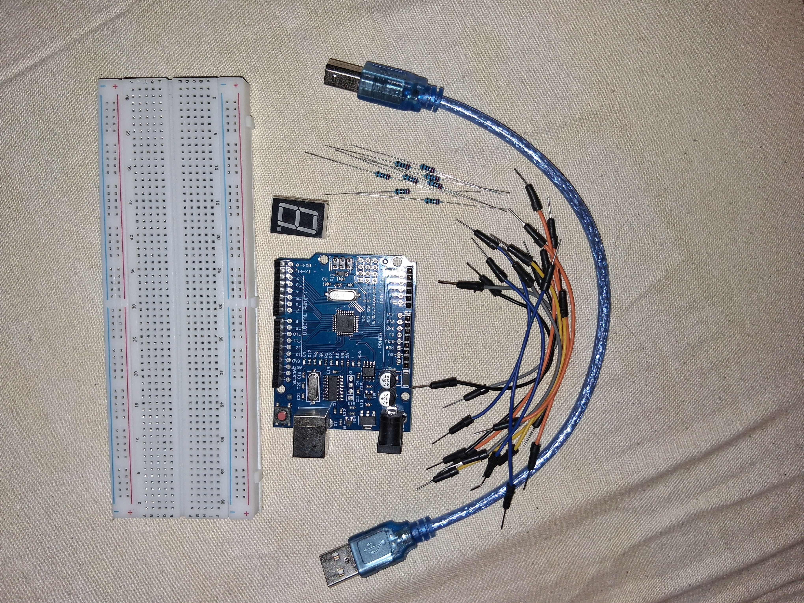
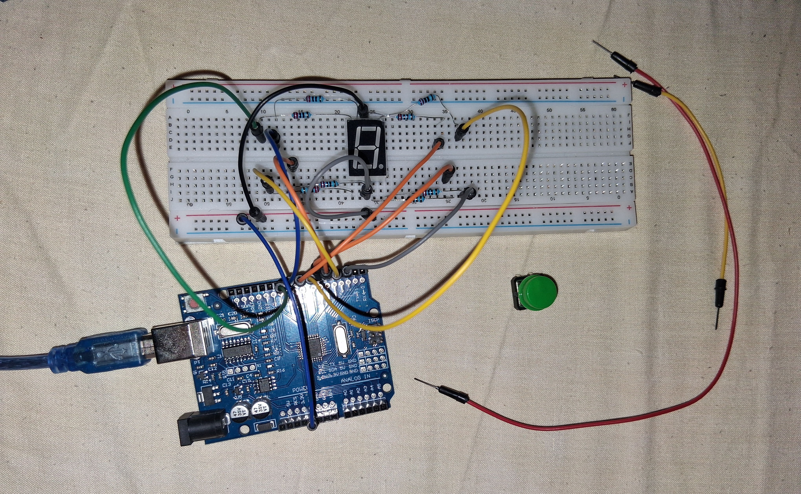
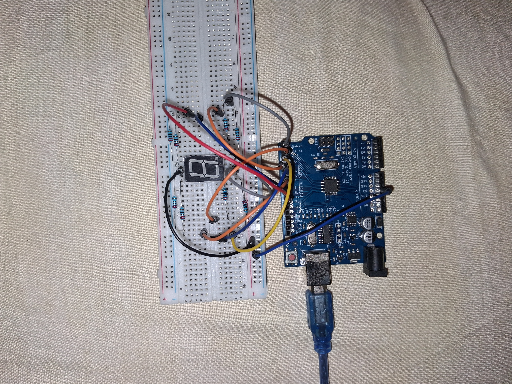
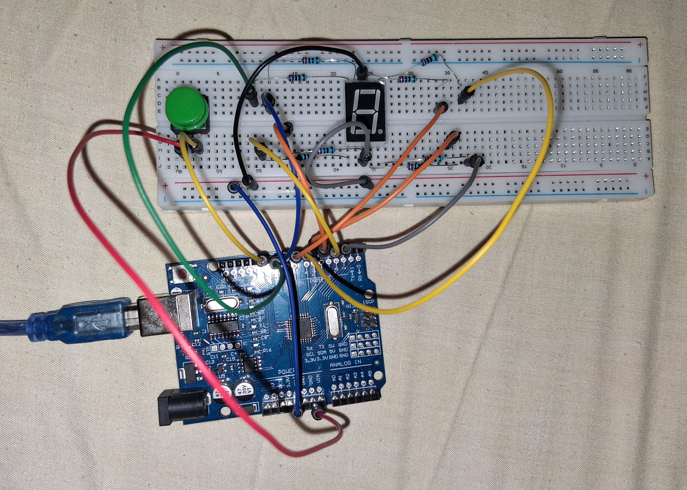
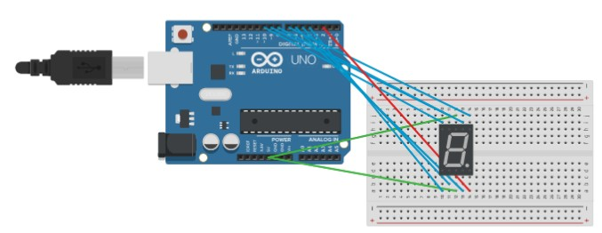
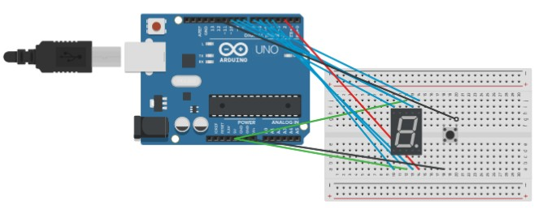

# Arduino-Digital Dice

## Description

This project simulates a digital dice through arduino uno and 7 segment display.

Version 2 (V2) - I added button so that the loop begins every time button is pressed otherwise it is in waiting mode

## Components

- Arduino Uno
- USB Cable
- Breadboard
- 7 Segment Display
- 8 x 220Ω resistors
- Jumper Wires

### V2 Additionals

- Button 

## Wiring

- 5V -> Segment Display pin 3
- 5V -> Segment Display pin 8
- Arduino digital pin 2 -> Segment Display pin DP - 5
- Arduino digital pin 4 -> Segment Display pin E - 1
- Arduino digital pin 5 -> Segment Display pin D - 2
- Arduino digital pin 6 -> Segment Display pin C - 4
- Arduino digital pin 7 -> Segment Display pin B - 6
- Arduino digital pin 8 -> Segment Display pin A - 7
- Arduino digital pin 9 -> Segment Display pin F - 9
- Arduino digital pin 10 -> Segment Display pin G - 10

### V2 Additionals

- GND -> Button
- Aduino digital pin 12 -> Button

## Diagram

### Version 1

### Version 2

## Skills Learned

- 7 Segemnt Display Wiring
- 7 Segment Display Usage - Coding
- randomSeed()
- random()

## Author

Nastoula Maria